<div align="center">


# screenmates

A self-hosted web app for movie nights with friends.

[](https://github.com/marcmeier/screenmates/actions/workflows/ci.yml)
[](https://github.com/marcmeier/screenmates/releases)
[](LICENSE)

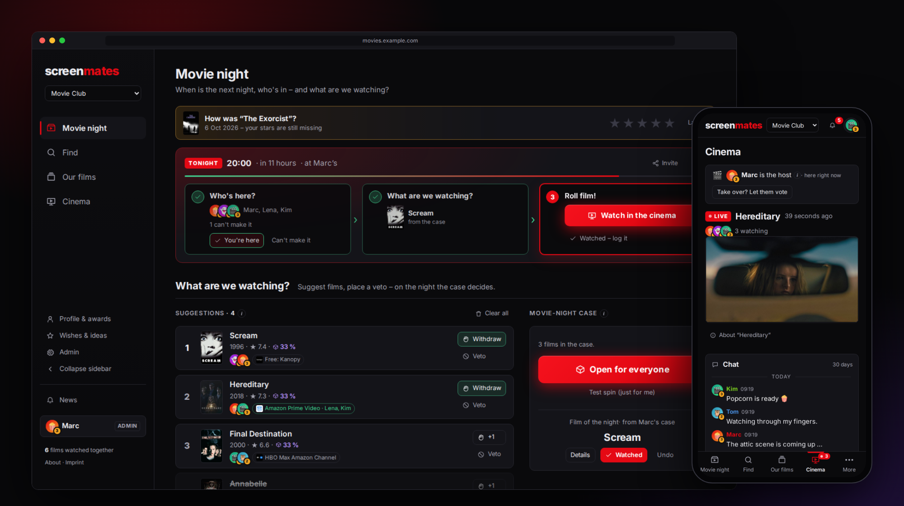

</div>

screenmates is what my friends and I use for our movie nights. It keeps track of who's coming,
collects film suggestions, picks one at random (weighted by votes), lets everyone watch together over
WebRTC when we're not in the same room, and keeps a history of what we watched and how we rated it.

It runs as a single Docker container next to a small media server, needs no accounts, and is
invite-only. The UI is available in English and German.

## Features

**Planning**
- Everyone replies with yes, maybe or no for the next date. If the date is still open, start a poll.
- Invitation card as an image for the group chat, `.ics` download and a calendar subscription.
- On the day itself, an evening mode walks through who's here, picking the film and starting it.

**Picking the film**
- Everyone can suggest films and veto one.
- The case: a reel of posters spins and stops on the film of the night, CS2-style. The odds depend on
  the votes and are shown as rarity colors. The host opens it for everyone at the same time.
- Each suggestion shows a predicted group rating and where it's streaming (your subscriptions first).

**Finding films**
- Browse shelves per streaming service and genre, or filter the full catalog by service, genre,
  decade, rating and runtime. Data comes from TMDB.
- Search for films and people. Optionally, describe what you're in the mood for and let an LLM
  suggest films (bring your own Anthropic or OpenRouter key).
- Film pages with trailer, streaming offers, cast, similar films and a per-person rating prediction
  based on each person's own ratings ([how it works](docs/PREDICTION.md)).

**Watching together**
- The host shares a browser tab or streams from OBS via WHIP. Viewers get the picture with under a
  second of delay, up to 1080p with stereo sound.
- Chat and emoji reactions on top of the picture, a pause screen, and a "be right back" button.

**Afterwards**
- History with ratings, attendees and a guestbook with replies.
- A reminder the next day to rate the film.
- A yearly review with stats (most divisive film, harshest critic, etc.), also as a tap-through story.

**Other things**
- Achievements with levels, modeled on Xbox/Steam ([details](docs/AWARDS.md)).
- Taste matching: who rates films most like you.
- Live updates without reloading, and Web Push notifications (also on iOS as a home-screen app).
- Seven color themes and a choice of fonts, per person.

**Groups and access**
- Invite links only. Links either add people directly or need approval, and can expire.
- No accounts and no passwords: your name belongs to the device you created it on. Another phone,
  laptop or TV gets it with a one-time login code (text, link or QR code).
- One server can host several groups, each with its own movie night, history and cinema
  ([groups](docs/GROUPS.md)).
- A host role that can be handed over or taken over by vote.
- Admin area with user management, AI usage costs and a reset option that backs up the database first.

## Screenshots

| Movie night | Find |
|---|---|
| 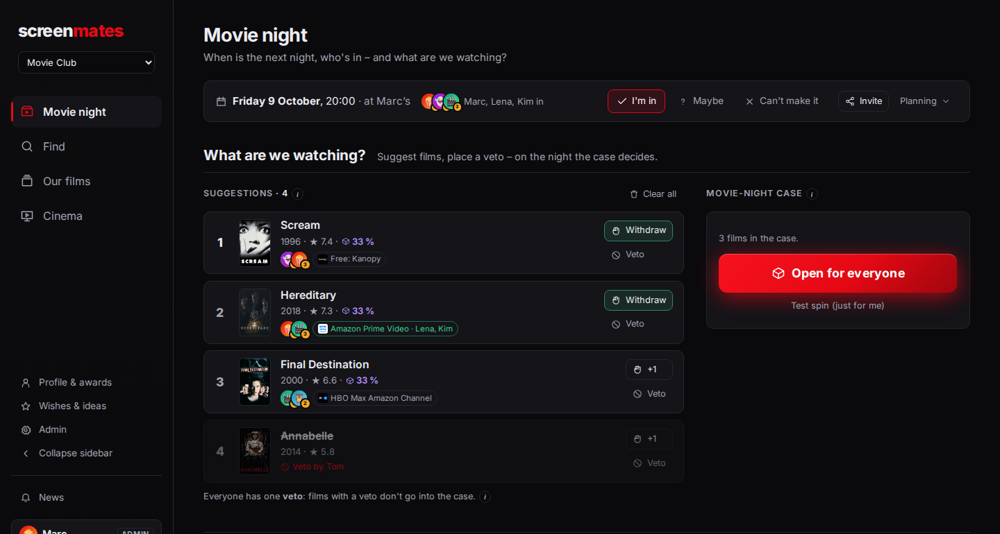 | 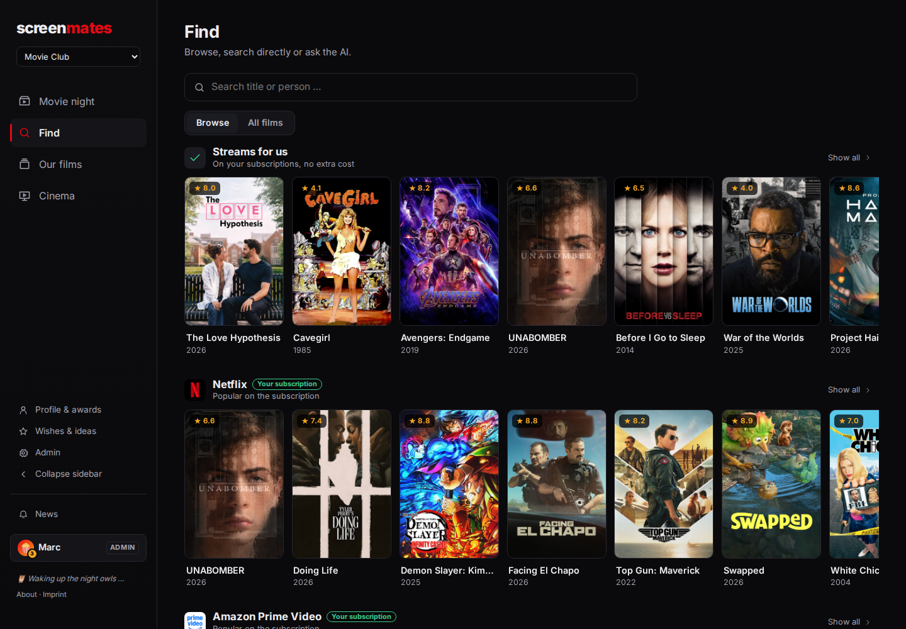 |
| **Opening the case** | **Film details** |
| 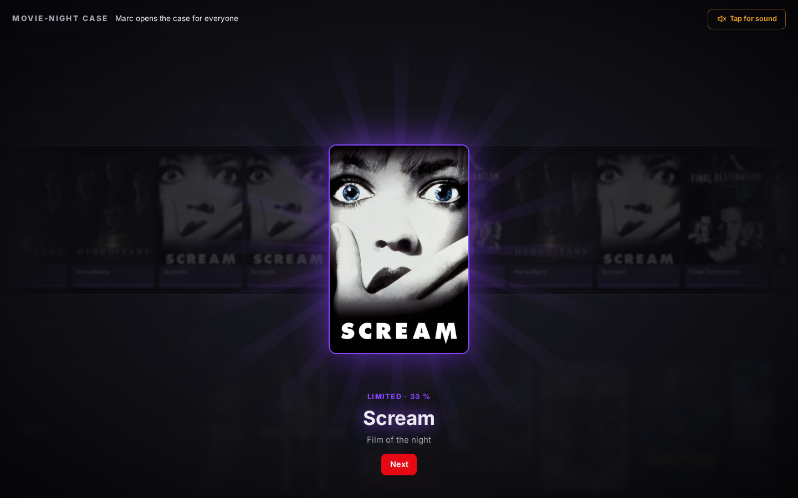 | 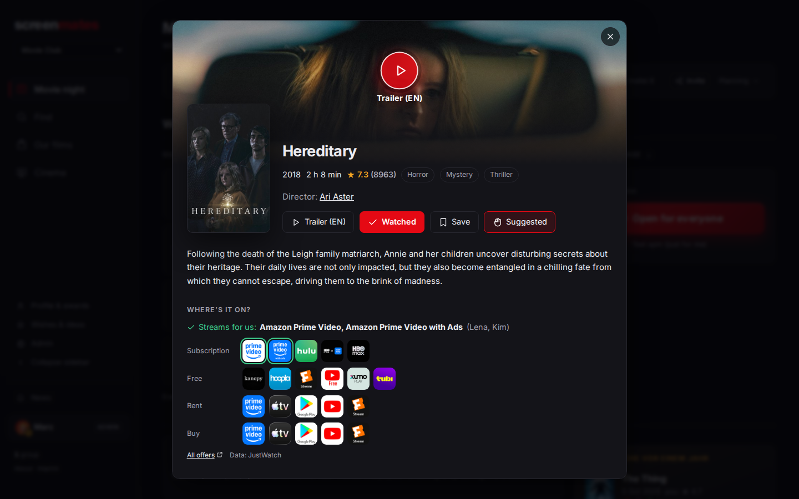 |
| **Cinema** | **History** |
| 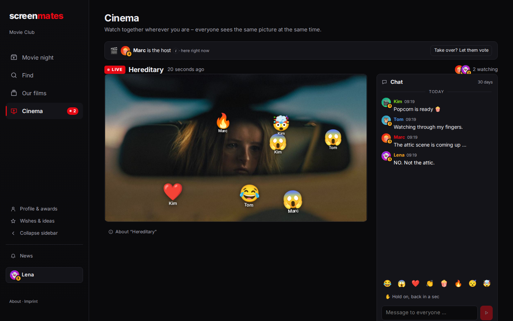 | 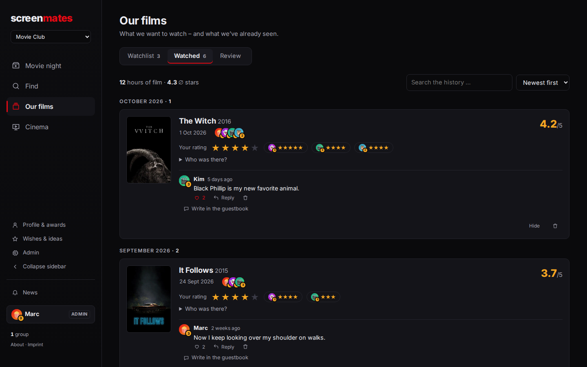 |
| **Evening mode** | **Profile** |
| 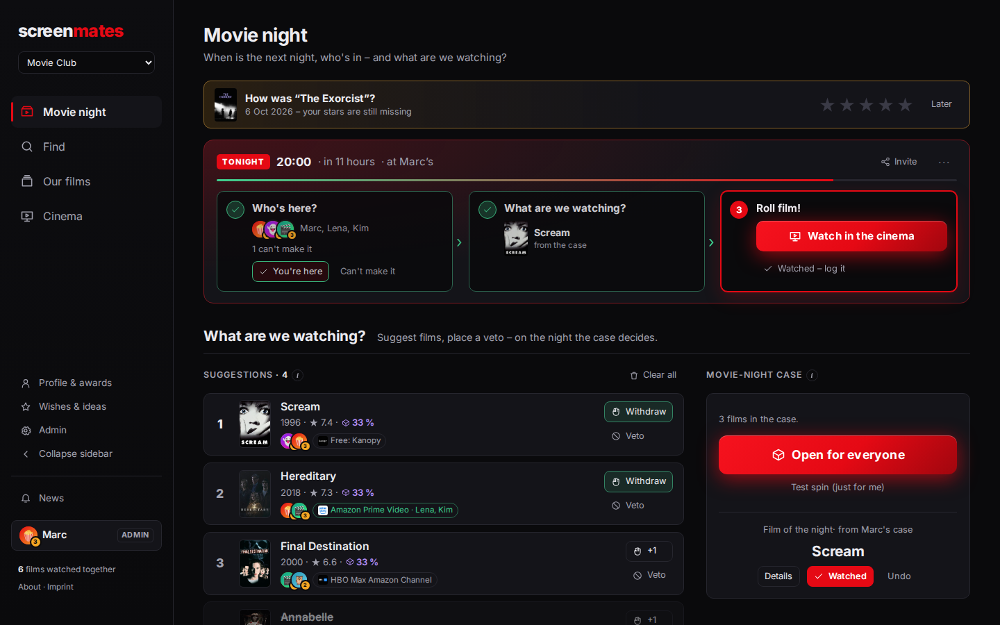 | 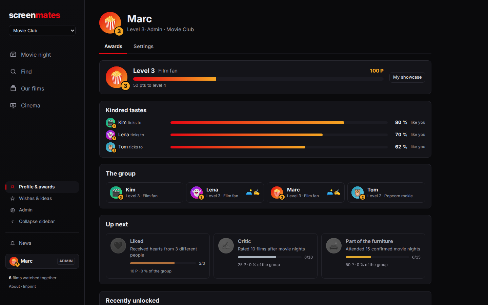 |
| **Year in review** | **Date poll** |
| 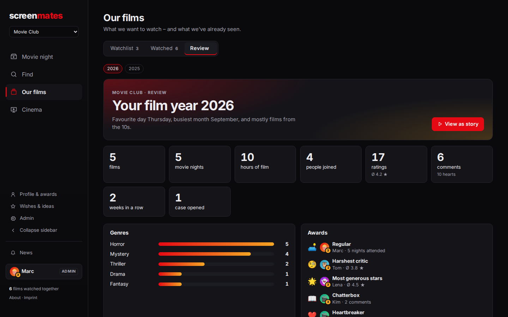 | 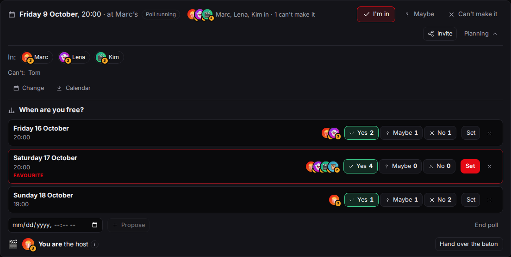 |

<details>
<summary>More screenshots</summary>

| Phone | Cinema on a phone | Year in review as story |
|---|---|---|
| 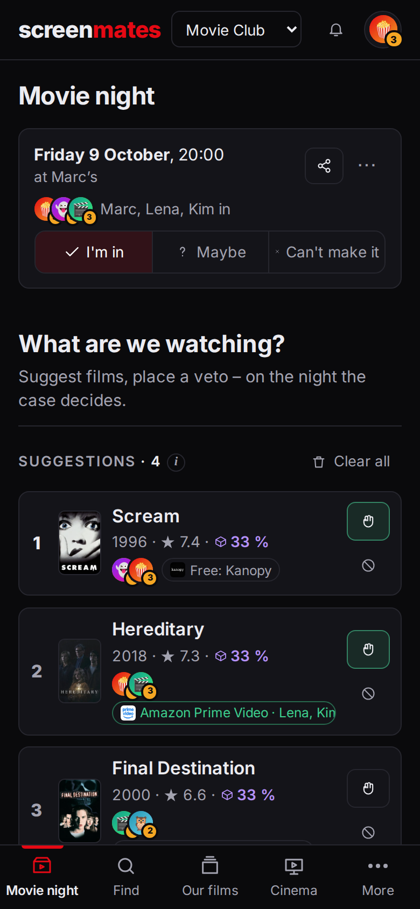 | 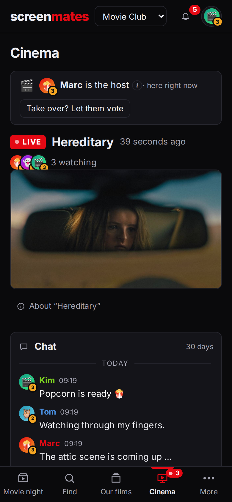 | 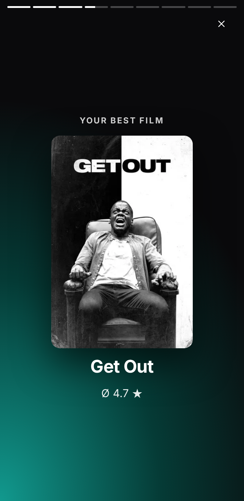 |

| Host handover vote | Themes |
|---|---|
| 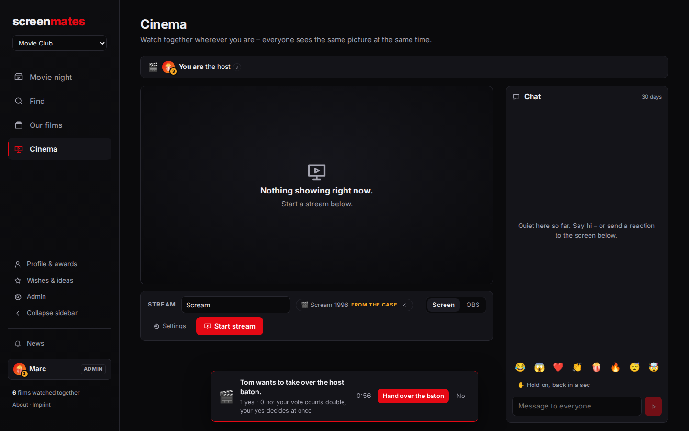 | 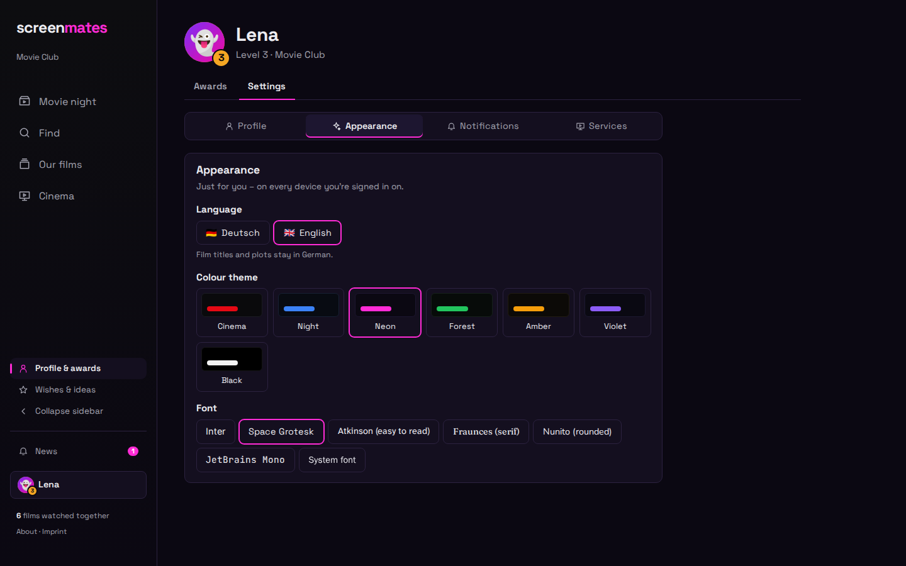 |

| Activity | Taste matching |
|---|---|
| 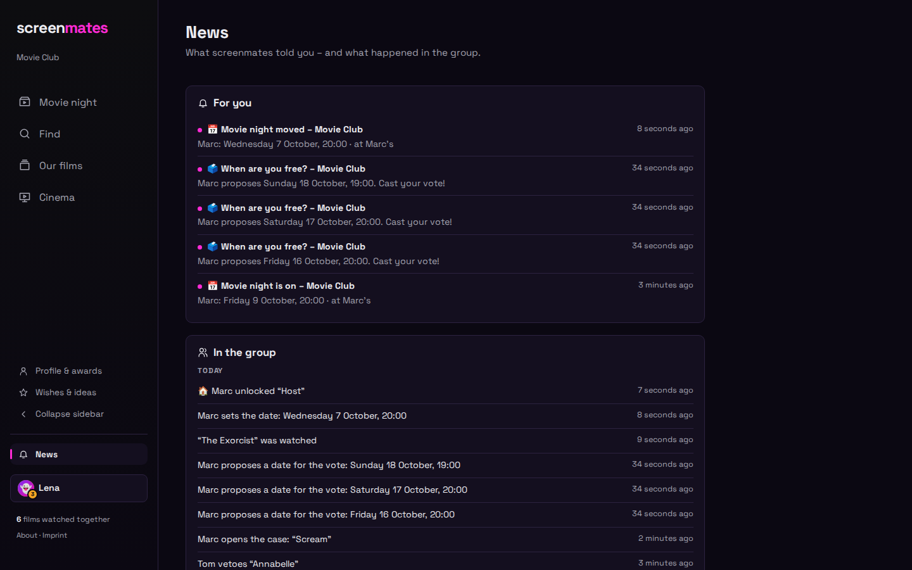 | 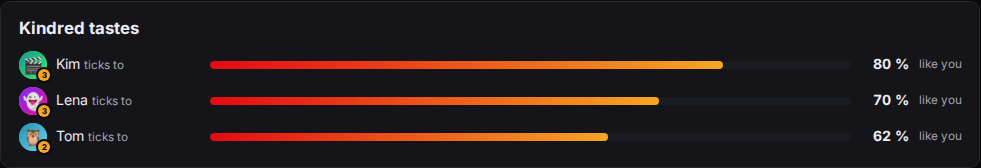 |

</details>

## Getting started

### Docker Compose

```bash
git clone https://github.com/marcmeier/screenmates.git
cd screenmates
cp backend/.env.example backend/.env   # add your TMDB key here
docker compose up -d --build
```

Then open http://localhost:8000. The first name you create becomes admin; invite links for others are
under Admin → Groups.

The compose file starts screenmates and MediaMTX (for the cinema). Database, push keys and profile
pictures are stored in the `screenmates-data` volume, so that's what you back up.

Without a TMDB key you get a small demo catalog. With a free
[TMDB API key](https://www.themoviedb.org/settings/api) in `backend/.env`, click "Sync with TMDB" in the
admin area to load the real catalog.

### From source

Python 3.12+ and Node 20+:

```bash
make install   # backend venv + npm ci
make dev       # backend on :8000, Vite on :5173
```

`make help` lists the other targets. See [CONTRIBUTING.md](CONTRIBUTING.md) for tests and linting.

### Running it on the internet

Put it behind a reverse proxy with HTTPS and set `COOKIE_SECURE=true` and `FORWARDED_ALLOW_IPS` (the
proxy's address). The cinema needs a few more steps, see below.

## Configuration

All settings are optional and go into `backend/.env` or the environment.

| Variable | Default | Description |
|---|---|---|
| `TMDB_API_KEY` | | TMDB v3 key or v4 token. Enables the full catalog, posters, people, trailers and streaming offers. |
| `TMDB_LANGUAGE` | `de-DE` | Language for film data, e.g. `en-US`. |
| `TMDB_REGION` | `DE` | Region for streaming offers, e.g. `US`. |
| `LLM_API_KEY` | | Anthropic or OpenRouter (`sk-or-…`) key for the AI search. |
| `LLM_MODEL`, `LLM_PROVIDER`, `LLM_BASE_URL` | | Model, provider override, or any OpenAI-compatible endpoint. OpenRouter defaults to `deepseek/deepseek-v4.1-flash`. |
| `DATABASE_URL` | SQLite | `backend/screenmates.db`, or `/data/screenmates.db` in Docker. |
| `MEDIA_DIR` | `backend/media` | Profile pictures (`/data/media` in Docker). |
| `COOKIE_SECURE` | `false` | Set to `true` behind HTTPS. |
| `FORWARDED_ALLOW_IPS` | | Reverse proxy IPs, so rate limiting sees the real client IP. |
| `CORS_ORIGINS` | | Only needed if frontend and API are on different origins. |
| `PUSH_KONTAKT` | | Contact (`mailto:` or `https:`) sent to browser push services. Push keys are generated automatically; push needs HTTPS. |
| `KINO_PUBLIC_HOST` | | Compose only: public hostname/IP of the server for cinema viewers outside your network. |

### Admin CLI

```bash
docker compose exec screenmates python -m app.cli namen          # list names
docker compose exec screenmates python -m app.cli admin "Alice"  # make someone admin
docker compose exec screenmates python -m app.cli einladung      # one-time invite link, valid 24 h
docker compose exec screenmates python -m app.cli login "Alice"  # login code for Alice's new device, 24 h
```

Useful for giving an existing installation its first admin, or getting back in after losing your only
device.

## Cinema

Streaming goes through [MediaMTX](https://github.com/bluenviron/mediamtx). The host sends one stream to
MediaMTX, which forwards it to every viewer. screenmates proxies the WebRTC signaling (WHIP for sending,
WHEP for watching) and checks permissions; MediaMTX's HTTP ports aren't exposed.

For local development, `make kino-install` downloads a pinned MediaMTX and `make dev` starts it. In
Docker it's already part of `compose.yaml`.

For viewers outside your network:

1. Open port 8189 (UDP, plus TCP as a fallback).
2. Set `KINO_PUBLIC_HOST` to your server's public name or IP.
3. Raise the UDP receive buffer, otherwise 1080p keyframes overflow the 208 KB Linux default:
   `net.core.rmem_max=8388608` on the host and `MTX_UDPREADBUFFERSIZE=8388608` for MediaMTX.

The server needs about 2–8 Mbit/s upload per viewer, depending on the quality setting.

Sending works either from the browser (share a tab and tick "Share audio"; choose 1080p/720p/480p and
"film" or "game" mode) or from OBS 30+ with the WHIP service, using the server URL and token shown in
the cinema. For films, OBS with the file as a media source gives the smoothest result. The reasoning
behind the encoder settings is in [docs/CINEMA-QUALITY.md](docs/CINEMA-QUALITY.md).

Note that DRM-protected services like Netflix show up black when screen-shared.

CI tests browser streaming, an OBS-like WHIP sender (FFmpeg), watching with audio and TCP fallback, also
against the full Docker setup. Real OBS and viewers over the internet have a manual
[checklist](docs/CINEMA-CHECKLIST.md).

## Architecture

```
frontend/  Vue 3, Vite, Pinia, vue-i18n
backend/   FastAPI, SQLModel, SQLite, Alembic
deploy/    MediaMTX config
```

In development Vite proxies `/api` to the backend; in production FastAPI serves both the API and the
built frontend. Migrations run automatically on startup. Clients poll `/api/live` for changes, which
works behind any proxy without WebSockets.

The endpoints are documented in [docs/API.md](docs/API.md); a running backend also serves OpenAPI docs
at `/docs`.

`make lint` runs ruff and eslint, `make test` runs the pytest suite and the Playwright E2E tests. CI
runs both on every push, plus the E2E suite against the Docker Compose setup.

## Documentation

- [Groups](docs/GROUPS.md): multiple groups on one server, roles, invitations
- [Awards](docs/AWARDS.md): achievement catalog, levels, anti-abuse rules
- [Prediction](docs/PREDICTION.md): how the rating prediction works and how accurate it is
- [Cinema quality](docs/CINEMA-QUALITY.md): measurements behind the streaming settings
- [Cinema checklist](docs/CINEMA-CHECKLIST.md): manual test for OBS and remote viewers
- [API](docs/API.md): all endpoints and permissions
- [Changelog](CHANGELOG.md)

## Roadmap

- TV series
- Cutting and sharing clips

Ideas and bug reports are welcome as [issues](https://github.com/marcmeier/screenmates/issues).

## Contributing

See [CONTRIBUTING.md](CONTRIBUTING.md). Please report security issues privately as described in
[SECURITY.md](SECURITY.md).

## License

[AGPL-3.0](LICENSE).

## Credits

Film data, images and streaming offers come from [TMDB](https://www.themoviedb.org) (streaming data via
[JustWatch](https://www.justwatch.com)). This product uses the TMDB API but is not endorsed or certified
by TMDB.

Streaming runs on [MediaMTX](https://github.com/bluenviron/mediamtx). Inspired by
[horror.marha.de](https://horror.marha.de).
