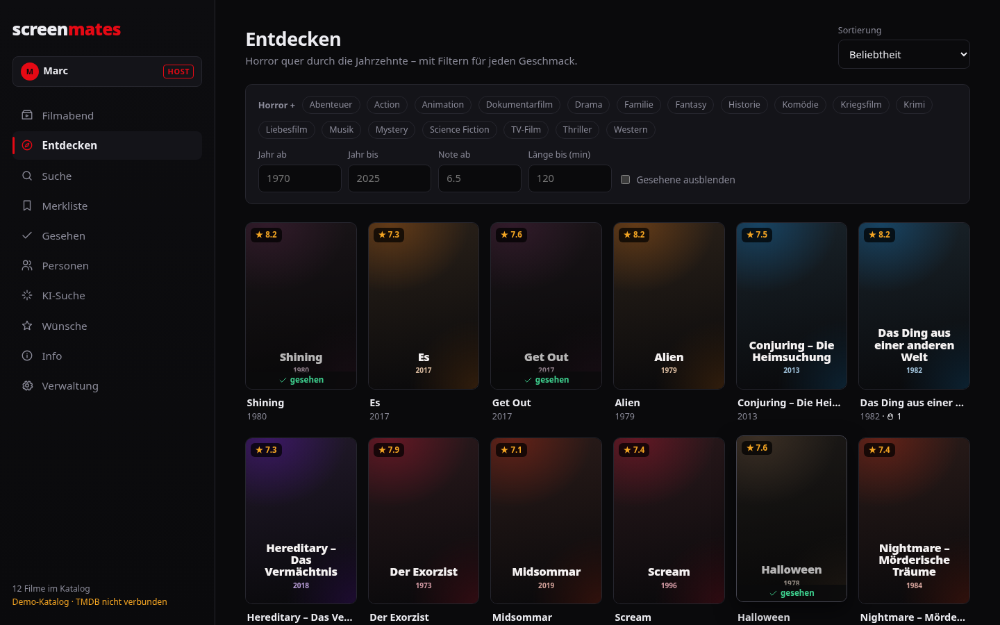
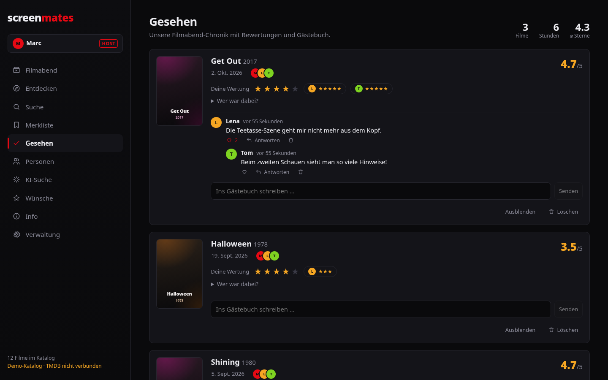

# screenmates

**Der Organizer für den gemeinsamen Horror-Filmabend.** Filme entdecken,
vorschlagen, das Glücksrad entscheiden lassen – und danach bewerten und im
Gästebuch nachdiskutieren.


## Was es kann

- **Filmabend** – wer ist dabei, gerankte Vorschläge der Gruppe, ein **Glücksrad**,
  dessen Felder nach Stimmen gewichtet sind, und ein Aktivitäts-Feed.
- **Entdecken & Suche** – Horror nach Jahrzehnt, Note, Länge und Subgenre, dazu Volltextsuche.
  Mit TMDB-Key ist der ganze TMDB-Katalog verfügbar, ohne Key gibt es einen Demo-Katalog.
- **Detailansicht** – Besetzung (klickbar zur Filmografie) und ähnliche Filme.
- **Gesehen** – die Chronik: Bewertungen pro Person, Teilnehmende, Gästebuch mit Antworten und Herzen.
- **Personen** – Regie, Cast und Crew mit ihrer Horror-Filmografie.
- **KI-Suche** – „langsamer Folk-Horror, aber nicht zu brutal“ → passende, real existierende Filme.
- **Wünsche** – Feature-Ideen mit Voting.
- **Film als Passwort** – keine Accounts: Man wählt seinen Namen und schützt ihn optional mit
  einem Film, den man beim Anmelden anklicken muss. Wer den Host-Film kennt, wird Host
  (`Strg+Shift+H`) und verwaltet Katalog und Gruppe.

| Entdecken | Detail | Chronik | Mobil |
|---|---|---|---|
|  |  |  |  |

## Schnellstart

Voraussetzungen: Python ≥ 3.12, Node ≥ 20.

```bash
make install   # venv + npm ci
make dev       # Backend :8000 + Vite :5173 → http://localhost:5173
```

Ohne Konfiguration läuft screenmates sofort mit einem Demo-Katalog bekannter
Horrorfilme. Für den echten Katalog `backend/.env.example` nach `backend/.env`
kopieren, `TMDB_API_KEY` eintragen und als Host in der Verwaltung
„Mit TMDB abgleichen“ klicken.

`make help` listet alle Befehle.

### Docker

```bash
docker compose up --build     # http://localhost:8000, Daten im Volume screenmates-data
```

## Konfiguration

Alles optional, über `backend/.env` oder Umgebungsvariablen:

| Variable | Zweck |
|---|---|
| `TMDB_API_KEY` | Echter Filmkatalog, Poster, Personen ([Key holen](https://www.themoviedb.org/settings/api)). v3-Key oder v4-Token. |
| `LLM_API_KEY` | Aktiviert die KI-Suche (Anthropic). `LLM_MODEL` wählt das Modell. |
| `DATABASE_URL` | Standard: SQLite in `backend/screenmates.db`. |
| `COOKIE_SECURE` | `true` hinter HTTPS. |
| `CORS_ORIGINS` | Nur nötig, wenn Frontend und API auf verschiedenen Origins laufen. |

## Architektur

```
frontend/  Vue 3 + Vite + Pinia      ─┐  Entwicklung: Vite proxyt /api → :8000
backend/   FastAPI + SQLModel/SQLite ─┘  Produktion: FastAPI liefert API + gebaute SPA aus
```

- **Backend** (`backend/app`): Router nach Fachbereichen (`catalog`, `users`, `watched`,
  `lists`, `features`, `misc`). Autorisierung zentral als FastAPI-Dependencies in `session.py`,
  TMDB-Zugriff gekapselt in `tmdb.py` mit Fallback auf den lokalen Katalog.
- **Frontend** (`frontend/src`): Tabs unter `components/tabs`, wiederverwendbare Bausteine
  (`MovieCard`, `Poster`, `Modal`, `FilmPicker`, `SpinWheel`), Hash-Routing ohne Router-Abhängigkeit,
  zentrale API-Fehlerbehandlung mit Toasts.
- **Rechte:** Lesen darf jeder. Schreiben braucht einen gewählten Namen. Eigene Kommentare,
  Wünsche und Ratings verwaltet man selbst, alles Übergreifende macht der Host.

Die vollständige Endpunkt-Übersicht steht in [`docs/api-map.md`](docs/api-map.md), die interaktive
Doku unter `/docs`, wenn das Backend läuft.

## Qualität

```bash
make lint        # ruff + eslint
make test        # 51 Backend-Tests + 14 Playwright-E2E-Schritte gegen das echte Backend
```

GitHub Actions führt Lint, Unit- und E2E-Tests bei jedem Push aus. Was beim Review
gefunden und behoben wurde, steht in [`docs/REVIEW.md`](docs/REVIEW.md).

## Herkunft

screenmates ist ein unabhängiger Nachbau der Filmabend-App `horror.marha.de`, rekonstruiert
aus deren öffentlich ausgeliefertem Frontend und OpenAPI-Schema. Daten der Originalseite
werden nicht übernommen.

## Roadmap

- Video-Clips (Szenen ausschneiden und teilen) wie im Original
- Serien (braucht einen Schlüssel `media_type` + `id`)
- Datenbank-Migrationen (Alembic)
- Live-Updates per Server-Sent Events statt Neuladen
