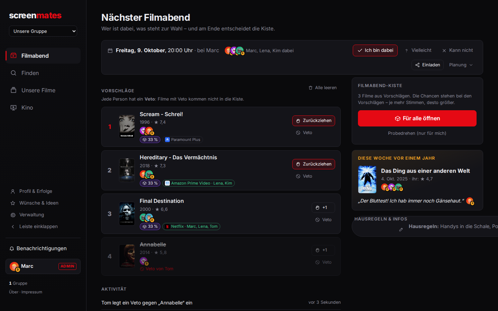
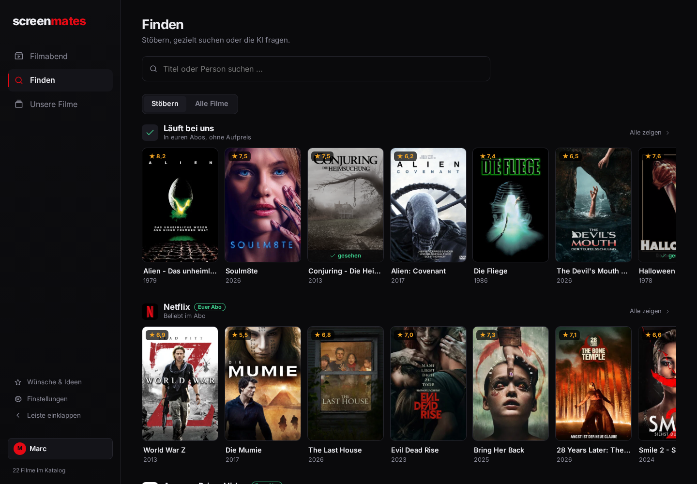
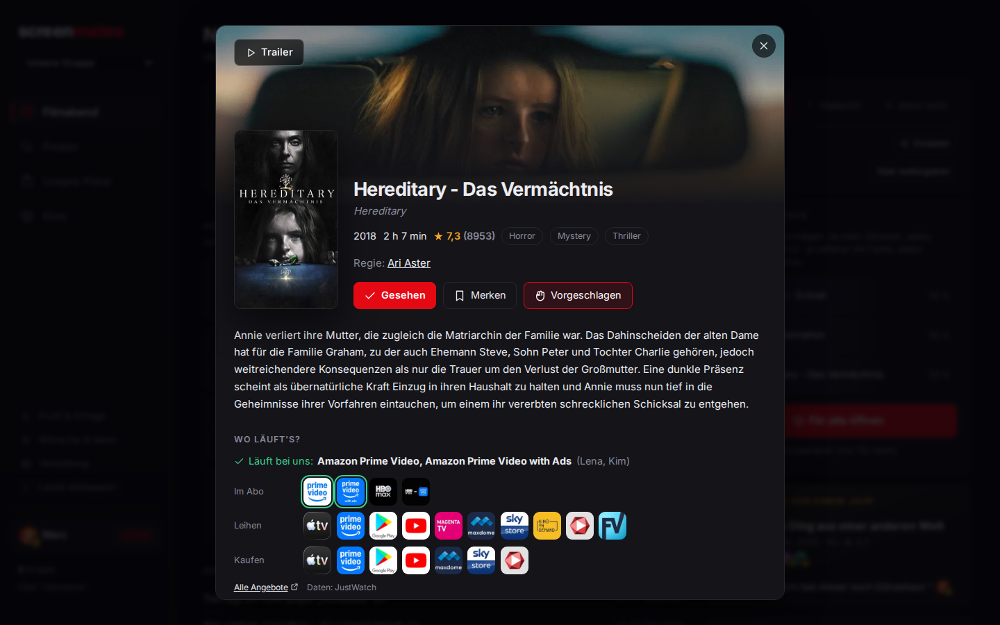
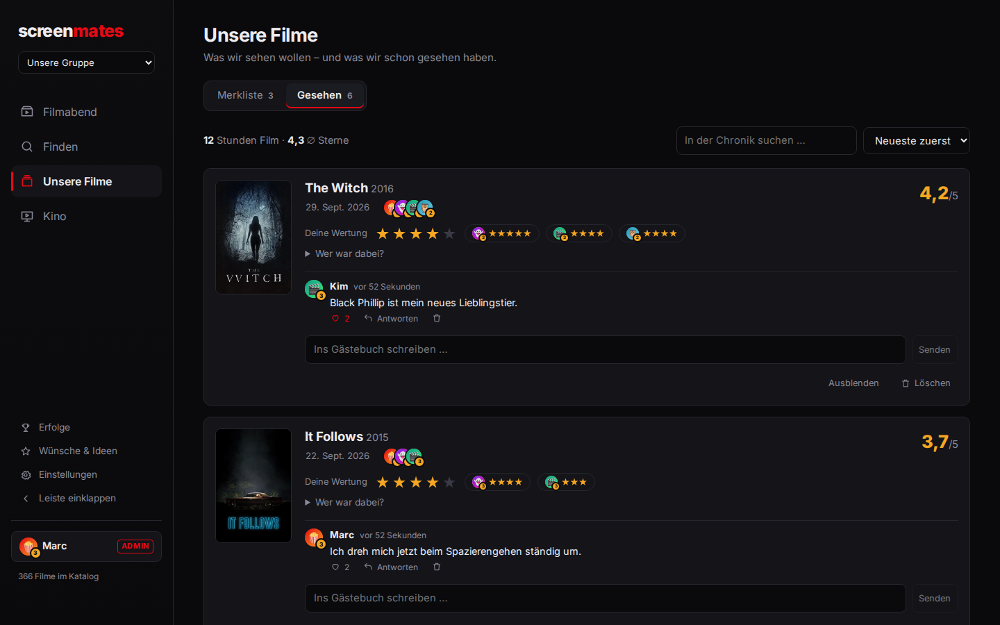
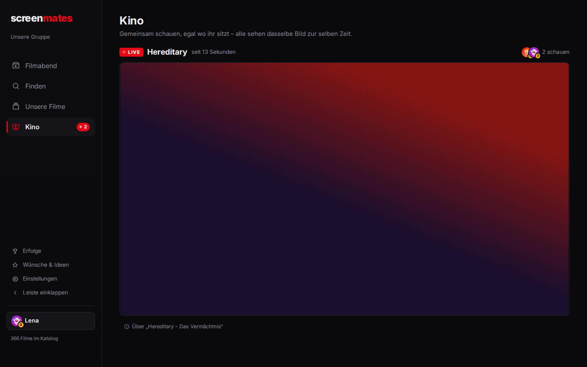
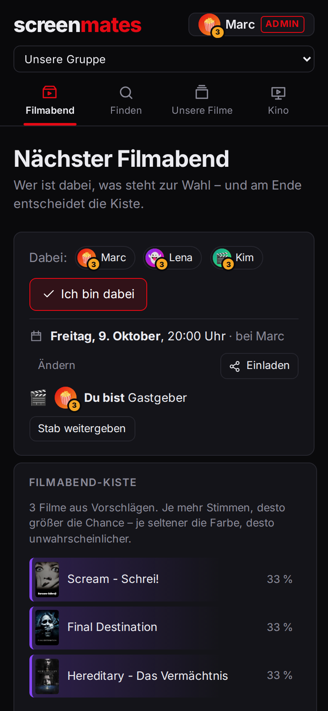

# screenmates

**Der Organizer für den gemeinsamen Horror-Filmabend.** Filme entdecken,
vorschlagen, die Filmabend-Kiste öffnen – und danach bewerten und im
Gästebuch nachdiskutieren.



## Was es kann

Drei Bereiche für die drei Dinge, für die man herkommt:

- **Filmabend** – wer ist dabei, **Termin und Einladungskarte** für den Gruppenchat, gerankte
  Vorschläge der Gruppe, ein **Veto** pro Person,
  die **Filmabend-Kiste**, die wie eine CS2-Kiste aufgeht (Seltenheitsfarben nach den echten
  Chancen, Stimmen erhöhen sie), Hausregeln & Infos und ein
  Aktivitäts-Feed. Dazu **„Heute vor einem Jahr"**: was ihr um dieses Datum früher geschaut habt.
- **Finden** – zum **Stöbern** Regale wie bei einem Streamingdienst: was bei euch im Abo läuft,
  das Horror-Angebot von Netflix, Prime Video, Disney+ & Co., Kostenloses, Neues, Geheimtipps und
  Klassiker. Unter „Alle Filme" das Raster nach Dienst, Subgenre, Jahrzehnt, Note und Länge.
  *Ein* Suchfeld für alles: Getippt findet es Filme und Personen (mit Horror-Filmografie), und **„KI fragen“**
  macht aus „langsamer Folk-Horror, aber nicht zu brutal“ passende, real existierende Filme.
- **Unsere Filme** – Merkliste und die Chronik des Gesehenen: Sterne und Kommentare pro Person,
  Teilnehmende, Gästebuch mit Antworten und Herzen.
- **Kino** – gemeinsam schauen, auch wenn alle in verschiedenen Wohnzimmern sitzen: Der Host
  teilt seinen Bildschirm oder sendet aus OBS (eigene Filme, Spiele …), alle sehen live dasselbe
  Bild mit unter einer Sekunde Verzögerung. Läuft etwas, leuchtet der Menüpunkt mit der Zahl der
  Zuschauenden. Danach trägt ein Klick den Film als gesehen ein, mit allen, die dabei waren.

Dazu: eine Detailansicht mit Trailer, **„Wo läuft's?“** (Abo, leihen, kaufen; Abos der Gruppe
zuerst), **„Wem gefällt's?"** (geschätzte Sterne pro Person aus den eigenen Bewertungen, siehe
[`docs/PROGNOSE.md`](docs/PROGNOSE.md)), Besetzung, ähnlichen Filmen und euren Bewertungen; **Wünsche & Ideen** mit Voting
und **Film als Passwort** – keine Accounts: Man wählt seinen Namen und schützt ihn optional
mit einem Film, den man beim Anmelden anklicken muss. Wer den Host-Film kennt, wird Host
(`Strg+Shift+H`) und verwaltet Katalog und Gruppe.

Mit TMDB-Key ist der ganze TMDB-Katalog verfügbar, ohne Key gibt es einen Demo-Katalog.

| Finden | Detail | Unsere Filme | Kino | Mobil |
|---|---|---|---|---|
|  |  |  |  |  |

## Schnellstart

Voraussetzungen: Python ≥ 3.12, Node ≥ 20.

```bash
make install   # venv + npm ci
make dev       # Backend :8000 + Vite :5173 → http://localhost:5173
```

Ohne Konfiguration läuft screenmates sofort mit einem Demo-Katalog bekannter
Horrorfilme. Für den echten Katalog `backend/.env.example` nach `backend/.env`
kopieren, `TMDB_API_KEY` eintragen und als Host in der Verwaltung
„Mit TMDB abgleichen“ klicken.

`make help` listet alle Befehle.

### Docker

```bash
docker compose up --build     # http://localhost:8000, Daten im Volume screenmates-data
```

## Konfiguration

Alles optional, über `backend/.env` oder Umgebungsvariablen:

| Variable | Zweck |
|---|---|
| `TMDB_API_KEY` | Echter Filmkatalog, Poster, Personen ([Key holen](https://www.themoviedb.org/settings/api)). v3-Key oder v4-Token. |
| `LLM_API_KEY` | Aktiviert die KI-Suche (Anthropic). `LLM_MODEL` wählt das Modell. |
| `DATABASE_URL` | Standard: SQLite in `backend/screenmates.db`. |
| `COOKIE_SECURE` | `true` hinter HTTPS. |
| `CORS_ORIGINS` | Nur nötig, wenn Frontend und API auf verschiedenen Origins laufen. |

## Kino

Das Kino überträgt per WebRTC über den Medienserver [MediaMTX](https://github.com/bluenviron/mediamtx):
Der Host sendet **einmal** dorthin, MediaMTX verteilt an alle. screenmates leitet nur die
Verbindungsaushandlung (WHIP zum Senden, WHEP zum Schauen) weiter und prüft dabei die Rechte –
senden darf nur der Host, schauen jeder mit Namen. MediaMTX fragt bei jeder Aktion bei
screenmates nach (`/api/kino/mtx-auth`); seine eigenen HTTP-Ports bleiben intern.

**Einrichten**

```bash
make kino-install   # lädt MediaMTX (feste Version, Prüfsumme) nach .tools/
make dev            # startet es automatisch mit, der Menüpunkt „Kino“ erscheint
```

Mit Docker ist MediaMTX in `compose.yaml` schon dabei.

**Damit Freunde von außen zuschauen können**, muss screenmates im Internet erreichbar sein
(Server/VPS, Heimserver mit Portfreigabe oder ein privates Netz wie Tailscale), und zusätzlich:

- Port **8189** (UDP, TCP als Ausweichweg) zum Medienserver freigeben,
- `KINO_PUBLIC_HOST=dein.server.de` setzen (Compose) bzw. `MTX_WEBRTCADDITIONALHOSTS`, damit
  die Zuschauenden eine erreichbare Adresse bekommen,
- hinter HTTPS `COOKIE_SECURE=true` setzen.

Bandbreite: Der Server braucht je nach Qualitätsstufe 2–8 Mbit/s Upload **pro Zuschauer**, der Host sendet nur einmal.

**Senden**

- *Bildschirm teilen* – direkt im Browser, ein Klick. Für Ton am einfachsten einen Tab teilen und
  „Audio teilen“ anhaken. Wählbar: **Qualität** Hoch (1080p) / Mittel (720p) / Sparsam (480p) und
  **Inhalt** Film (Schärfe zuerst) / Spiel (flüssig, bis 60 fps). Gesendet wird H.264 – warum, steht
  mit Messwerten in [`docs/KINO-QUALITAET.md`](docs/KINO-QUALITAET.md).
- *OBS* (ab Version 30) – in OBS unter Einstellungen → Stream den Dienst **WHIP** wählen und
  Server + Bearer-Token aus der Kino-Seite eintragen; für 1080p 6000–8000 kbit/s,
  Keyframe-Intervall 1 s, keine B-Frames.
  Damit gehen Szenen, Spielaufnahme, Filmdateien und voller Ton. **Für Filme die beste Wahl:** die
  Datei als „Medienquelle“ einbinden – gleichmäßiger als jedes Bildschirmteilen.

**Was automatisch getestet ist** (bei jedem Push, siehe `.github/workflows/ci.yml`): Senden aus dem
Browser, Senden wie OBS (FFmpeg per WHIP mit Stream-Key, H.264 + Opus), Zuschauen mit Ton, ein
Zuschauer mit gesperrtem UDP (TCP-Ausweichweg) – und all das zusätzlich gegen den echten
`docker compose`-Stack. Nicht automatisch prüfbar sind echtes OBS und Verbindungen über das
Internet; dafür gibt es die Checkliste in [`docs/KINO-CHECK.md`](docs/KINO-CHECK.md).

Gezeigt werden sollte, was ihr zeigen dürft – eigene Aufnahmen, Spiele, DRM-freie Filme.
Fenster von Netflix & Co. bleiben bei der Aufnahme ohnehin schwarz (DRM).

## Architektur

```
frontend/  Vue 3 + Vite + Pinia      ─┐  Entwicklung: Vite proxyt /api → :8000
backend/   FastAPI + SQLModel/SQLite ─┘  Produktion: FastAPI liefert API + gebaute SPA aus
```

- **Backend** (`backend/app`): Router nach Fachbereichen (`catalog`, `users`, `watched`,
  `lists`, `features`, `misc`). Autorisierung zentral als FastAPI-Dependencies in `session.py`,
  TMDB-Zugriff gekapselt in `tmdb.py` mit Fallback auf den lokalen Katalog.
- **Frontend** (`frontend/src`): Die drei Bereiche plus Wünsche und Einstellungen unter `components/tabs`,
  ihre Teilansichten in `components/finden` und `components/sammlung`, wiederverwendbare Bausteine
  (`MovieCard`, `Poster`, `Modal`, `FilmPicker`, `SpinWheel`), Hash-Routing ohne Router-Abhängigkeit,
  zentrale API-Fehlerbehandlung mit Toasts.
- **Datenbank:** Schema-Änderungen laufen über Alembic-Migrationen (`backend/migrations`), die
  die App beim Start selbst anwendet. Datenbanken aus 0.2/0.3 werden ohne Datenverlust
  übernommen. Neue Migration nach einer Modelländerung: `make migration name="…"`; ein Test
  schlägt fehl, wenn sie fehlt.
- **Rechte:** Lesen darf jeder. Schreiben braucht einen gewählten Namen. Eigene Kommentare,
  Wünsche und Ratings verwaltet man selbst, alles Übergreifende macht der Host.

Die vollständige Endpunkt-Übersicht steht in [`docs/api-map.md`](docs/api-map.md), die interaktive
Doku unter `/docs`, wenn das Backend läuft.

## Qualität

```bash
make lint        # ruff + eslint
make test        # 110 Backend-Tests + 34 Playwright-E2E-Schritte gegen das echte Backend
                 # (die 5 Kino-Schritte mit echtem MediaMTX, falls installiert)
```

GitHub Actions führt Lint, Unit- und E2E-Tests bei jedem Push aus. Was beim Review
gefunden und behoben wurde, steht in [`docs/REVIEW.md`](docs/REVIEW.md).

## Herkunft

screenmates ist ein unabhängiger Nachbau der Filmabend-App `horror.marha.de`, rekonstruiert
aus deren öffentlich ausgeliefertem Frontend und OpenAPI-Schema. Daten der Originalseite
werden nicht übernommen.

## Roadmap

- Kino: Chat und Reaktionen während der Vorstellung
- Video-Clips (Szenen ausschneiden und teilen) wie im Original
- Serien (braucht einen Schlüssel `media_type` + `id`)
- Live-Updates per Server-Sent Events statt Neuladen
